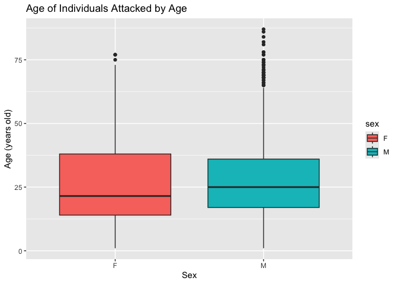

## Instructions
Answer the following questions and complete the exercises in RMarkdown. Please embed all of your code and push your final work to your repository. Your code must be organized, clean, and run free from errors. Remember, you must remove the `#` for any included code chunks to run. Be sure to add your name to the author header above. 

Your code must knit in order to be considered. If you are stuck and cannot answer a question, then comment out your code and knit the document.  

Don't forget to answer any questions that are asked in the prompt. Some questions will require a plot, but others do not- make sure to read each question carefully.  

For the questions that require a plot, make sure to have clearly labeled axes and a title. Keep your plots clean and professional-looking, but you are free to add color and other aesthetics.  

Be sure to follow the directions and push your code to your repository.

## Background
In the `data` folder, you will find data about global shark attacks. The data are updated continuously, and are taken from [opendatasoft](https://public.opendatasoft.com/explore/dataset/global-shark-attack/table/?flg=en-us&disjunctive.country&disjunctive.area&disjunctive.activity).  

## Load the libraries

```r
library("tidyverse")
library("janitor")
library("naniar")
```

## Load the data
Run the following code chunk to import the data.

```r
global_sharks <- read_csv("data/global-shark-attack.csv") %>% clean_names()
```

## Questions
1. (2 points) Start by doing some data exploration using your preferred function(s). What is the structure of the data? Where are the missing values and how are they represented?  

```r
glimpse(global_sharks)
```

```
## Rows: 6,890
## Columns: 21
## $ date                   <date> 2023-07-29, 2023-04-22, 2023-03-02, 2023-02-18…
## $ year                   <dbl> 2023, 2023, 2023, 2023, 2022, 2022, 2021, 2021,…
## $ type                   <chr> "Unprovoked", "Unprovoked", "Unprovoked", "Ques…
## $ country                <chr> "USA", "AUSTRALIA", "SEYCHELLES", "ARGENTINA", …
## $ area                   <chr> "Florida", "Western Australia", "Praslin Island…
## $ location               <chr> "Tampa Bay", "Lucy's Beach", NA, "Chubut Provin…
## $ activity               <chr> "Swimming", "Surfing", "Snorkeling", NA, "Snork…
## $ name                   <chr> "Natalie Branda", "Max Marsden", "Arthur \xc9",…
## $ sex                    <chr> "F", "M", "M", "M", "F", "M", "M", "M", "M", "M…
## $ age                    <chr> "26", "30", "6", "32", NA, "21.0", "15.0", "73.…
## $ injury                 <chr> "Superficial injuries to abomen and thighs", "B…
## $ fatal_y_n              <chr> "N", "N", "UNKNOWN", "UNKNOWN", "N", "N", "N", …
## $ time                   <chr> "20h00", "07h15", "Afternoon", NA, "12h30", "15…
## $ species                <chr> NA, "Bronze whaler shark, 1.5 m", "Lemon shark"…
## $ investigator_or_source <chr> "Fox12, 8/1/2023", "The West Australian, 4/22/2…
## $ pdf                    <chr> NA, NA, NA, NA, "2022.07.28-Cornwall.pdf", "202…
## $ href_formula           <chr> NA, NA, NA, NA, "http://sharkattackfile.net/spr…
## $ href                   <chr> NA, NA, NA, NA, "http://sharkattackfile.net/spr…
## $ case_number_19         <chr> NA, NA, NA, NA, "2022.07.28", "2022.03.09", "20…
## $ case_number_20         <chr> NA, NA, NA, NA, "2022.7.28", "2022.03.09", "202…
## $ original_order         <dbl> NA, NA, NA, NA, 6792, 6743, 6720, 6626, 6618, 6…
```


```r
names(global_sharks)
```

```
##  [1] "date"                   "year"                   "type"                  
##  [4] "country"                "area"                   "location"              
##  [7] "activity"               "name"                   "sex"                   
## [10] "age"                    "injury"                 "fatal_y_n"             
## [13] "time"                   "species"                "investigator_or_source"
## [16] "pdf"                    "href_formula"           "href"                  
## [19] "case_number_19"         "case_number_20"         "original_order"
```


```r
miss_var_summary(global_sharks)
```

```
## # A tibble: 21 × 3
##    variable n_miss pct_miss
##    <chr>     <int>    <dbl>
##  1 time       3518    51.1 
##  2 species    3118    45.3 
##  3 age        2982    43.3 
##  4 activity    586     8.51
##  5 sex         572     8.30
##  6 location    565     8.20
##  7 area        481     6.98
##  8 date        305     4.43
##  9 name        220     3.19
## 10 year        132     1.92
## # ℹ 11 more rows
```
They are NA's represented in all but one variable or it says "UNKNOWN" in the fatal_y_n 

2. (3 points) Are there any "hotspots" for shark incidents? Make a plot that shows the total number of incidents for the top 10 countries? Which country has the highest number of incidents?

```r
global_sharks %>% 
  count(country) %>% 
  arrange(desc(n)) %>% 
  top_n(10) %>% 
  ggplot(aes(x=country, y=n, fill=country))+
  geom_col()+
  coord_flip()+
  labs(title = "Number of Incidents in Top 10 Countries",
       x= "Country",
       y= "Number of Incidents")
```

```
## Selecting by n
```

<!-- -->
USA has the highest number of incidents 

3. (3 points) Are there months of the year when incidents are more likely to occur? Make a plot that shows the total number of incidents by month. Which month has the highest number of incidents?

```r
global_sharks %>% 
  separate(col= date, into = c("year","month","day"), sep = "-") %>% 
  mutate("month"=as.factor(month)) %>% 
  filter(month!="NA") %>% 
  count(month) %>% 
  ggplot(aes(x=month, y=n, color=month))+
  geom_col()+
  labs(title = "Incidents by Month",
       x= "Month",
       y= "Number of Incidents")
```

<!-- -->
January has the highest followed by July

4. (3 points) Which activity is associated with the highest number of incidents? Make a plot that compares the top 5 riskiest activities. "NA" should not be classified as an activity.

```r
global_sharks %>% 
  count(activity) %>% 
  filter(activity!="NA") %>% 
  arrange(desc(n)) %>% 
  top_n(5) %>% 
  ggplot(aes(x=activity, y=n, fill=activity))+
  geom_col()+
  labs(title = "Top 5 Riskiest Activites Based on Incidents",
       x= "Activity",
       y= "Number of Incidents")
```

```
## Selecting by n
```

<!-- -->
Surfing is associated with the most incidents. 

5. (3 points) The data include information on who was attacked. Make a plot that shows the total number of fatalities by sex- are males or females more likely to be killed by sharks?

```r
global_sharks %>% 
  select(sex,fatal_y_n) %>% 
  filter(fatal_y_n=="Y") %>% 
  filter(sex=="F" | sex=="M") %>% 
  count(sex, fatal_y_n) %>% 
  ggplot(aes(x=sex, y=n, fill=sex))+
  geom_col()+
  labs(title = "Fatalities by Sex",
       x= "Sex",
       y= "Fatalities")
```

<!-- -->


6. (3 points) Make a plot that shows the range of age for the individuals that are attacked. Make sure to restrict sex to M or F (some of the codes used are not clear). You will also need to find a way to manage the messy age column.

```r
global_sharks %>% 
  select(sex,age) %>% 
  filter(sex=="M" | sex=="F") %>% 
  separate(col=age, into= "age", sep = "&") %>% 
  mutate(age=as.integer(age)) %>% 
  filter(age!="NA") %>% 
  ggplot(aes(x=sex, y=age, fill=sex))+
  geom_boxplot()+
  labs(title = "Age of Individuals Attacked by Age",
       x= "Sex",
       y= "Age (years old)")
```

```
## Warning: Expected 1 pieces. Additional pieces discarded in 20 rows [186, 337, 1136,
## 1203, 1252, 2271, 2362, 3045, 3099, 3628, 4201, 4202, 4402, 4403, 4846, 5445,
## 5473, 5687, 5882, 5985].
```

```
## Warning: There was 1 warning in `mutate()`.
## ℹ In argument: `age = as.integer(age)`.
## Caused by warning:
## ! NAs introduced by coercion
```

<!-- -->


7. (3 points) In the United States, what are the top 5 states where shark attacks have been recorded since 1950? Make a plot that compares the number of incidents for these 5 states.

```r
global_sharks %>% 
  filter(country=="USA") %>% 
  filter(year>="1950") %>% 
  count(area) %>% 
  arrange(-n) %>% 
  top_n(5) %>% 
  ggplot(aes(x=area, y=n, fill=area))+
  geom_col()+
  labs(title = "Top 5 Incidents by State",
       x= "State",
       y= "Number of Incidents")
```

```
## Selecting by n
```

<!-- -->


8. (3 points) Make a new object that limits the data to only include attacks attributed to Great White Sharks. This is trickier than it sounds, you should end up with 494 observations. Look online and adapt code involving `str_detect`. Which country has the highest number of Great White Shark attacks?

```r
greatwhites <- global_sharks %>% 
  filter(str_detect(species, "White shark"))
```


```r
greatwhites %>% 
  count(country) %>% 
  arrange(-n)
```

```
## # A tibble: 36 × 2
##    country          n
##    <chr>        <int>
##  1 USA            150
##  2 AUSTRALIA      132
##  3 SOUTH AFRICA   124
##  4 ITALY           16
##  5 NEW ZEALAND     16
##  6 CROATIA          9
##  7 GREECE           4
##  8 CHILE            3
##  9 BAHAMAS          2
## 10 CANADA           2
## # ℹ 26 more rows
```
USA

9. (4 points) Use faceting to compare the number of fatal and non-fatal attacks for the top 5 countries with the highest number of Great White Shark attacks.

```r
greatwhites %>% 
  group_by(fatal_y_n) %>% 
  filter(fatal_y_n=="N" | fatal_y_n=="Y") %>% 
  count(country, sort = TRUE) %>% 
  top_n(5) %>% 
  ggplot(aes(x=country,y=n))+
  geom_col()+
  facet_wrap(~fatal_y_n)+
  theme(axis.text.x = element_text(angle = 60, hjust=1))+
  labs(title = "Fatal vs Non-Fatal Attacks for Top 5 Countries with Highest Number of Incidents",
       x= "Country",
       y= "Number of Incidents")
```

```
## Selecting by n
```

<!-- -->


10. (3 points) Using the `global_sharks` data, what is one question that you are interested in exploring? Write the question and answer it using a plot or table. 

Based on sex, what are the most common activities where attacks are occuring?

```r
global_sharks %>% 
  group_by(sex) %>% 
  filter(sex=="M" | sex=="F") %>% 
  filter(activity!="NA") %>% 
  count(activity, sort = TRUE) %>% 
  top_n(10) %>% 
  ggplot(aes(x=activity, y=n))+
  geom_col()+
  facet_wrap(~sex)+
  theme(axis.text.x = element_text(angle = 60, hjust = 1))
```

```
## Selecting by n
```

<!-- -->

