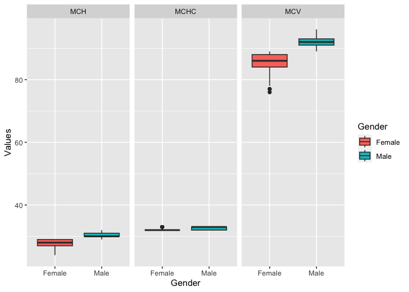
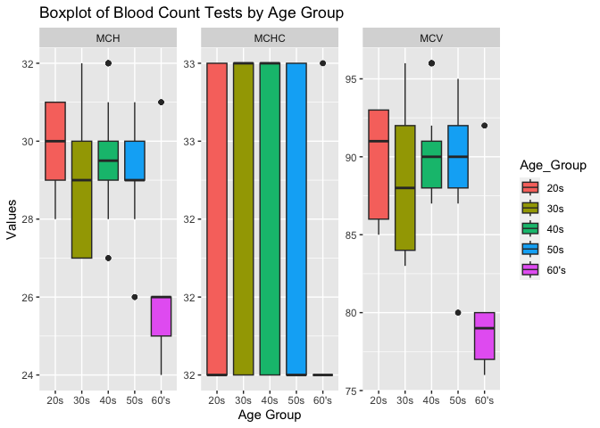

## Instructions
This homework is a bit less traditional this week. There are some errors in the code below. In addition add notes and titles to the code chunks that explains what the code chunck does. Use AI tools, notes from class, or any other resources to help fix the errors. Feel free to edit any plots to your preference. Don't forget to answer the two questions at the bottom. Upon completion, you should not have to '#' out any of the code chunks.

Push your final work to your repository. Your final lab report should be organized, clean, and run free from errors. Remember, you must remove the `#` for the included code chunks to run. Be sure to add your name to the author header above.   

Again make sure to use the formatting conventions of RMarkdown to make your report neat and clean!  


```r
library(tidyverse)
```

```
## ── Attaching core tidyverse packages ──────────────────────── tidyverse 2.0.0 ──
## ✔ dplyr     1.1.3     ✔ readr     2.1.4
## ✔ forcats   1.0.0     ✔ stringr   1.5.0
## ✔ ggplot2   3.4.4     ✔ tibble    3.2.1
## ✔ lubridate 1.9.3     ✔ tidyr     1.3.0
## ✔ purrr     1.0.2     
## ── Conflicts ────────────────────────────────────────── tidyverse_conflicts() ──
## ✖ dplyr::filter() masks stats::filter()
## ✖ dplyr::lag()    masks stats::lag()
## ℹ Use the conflicted package (<http://conflicted.r-lib.org/>) to force all conflicts to become errors
```

```r
library(janitor)
```

```
## 
## Attaching package: 'janitor'
## 
## The following objects are masked from 'package:stats':
## 
##     chisq.test, fisher.test
```

```r
library(dplyr)
```


1. Load Data

```r
blood_count <- read_csv("data/blood_count_dataset.csv") #wrong name for data
```

```
## Rows: 417 Columns: 9
## ── Column specification ────────────────────────────────────────────────────────
## Delimiter: ","
## chr (1): Gender
## dbl (8): Age, Hemoglobin, Platelet_Count, White_Blood_Cells, Red_Blood_Cells...
## 
## ℹ Use `spec()` to retrieve the full column specification for this data.
## ℹ Specify the column types or set `show_col_types = FALSE` to quiet this message.
```

2. Get an idea of Structure

```r
glimpse(blood_count) #spelled glimpse wrong
```

```
## Rows: 417
## Columns: 9
## $ Age               <dbl> 68, 25, 57, 28, 38, 47, 37, 30, 35, 22, 41, 34, 40, …
## $ Gender            <chr> "Female", "Male", "Male", "Female", "Male", "Female"…
## $ Hemoglobin        <dbl> 10.4, 13.8, 13.5, 12.7, 14.9, 12.0, 14.5, 11.8, 11.5…
## $ Platelet_Count    <dbl> 180000, 320000, 370000, 290000, 380000, 260000, 3800…
## $ White_Blood_Cells <dbl> 5700, 7500, 8500, 7800, 8700, 7000, 8700, 7000, 7100…
## $ Red_Blood_Cells   <dbl> 3.7, 5.4, 5.1, 4.8, 5.7, 4.4, 5.7, 4.2, 4.2, 5.6, 4.…
## $ MCV               <dbl> 77, 92, 90, 86, 95, 87, 95, 84, 84, 93, 88, 85, 96, …
## $ MCH               <dbl> 25, 30, 29, 29, 31, 28, 31, 27, 27, 31, 29, 28, 32, …
## $ MCHC              <dbl> 32, 32, 32, 33, 33, 32, 33, 32, 32, 32, 33, 32, 33, …
```

3. Compare min mean and max of red blood cell count by gender

```r
blood_count %>% 
  group_by(Gender) %>%  #need capital G and capitalize RBC
  summarize(min=min(Red_Blood_Cells), #forgot comma
            mean=mean(Red_Blood_Cells), #misspelled mean
            max=max(Red_Blood_Cells)) #needed another parenthesis
```

```
## # A tibble: 2 × 4
##   Gender   min  mean   max
##   <chr>  <dbl> <dbl> <dbl>
## 1 Female   3.6  4.36   4.9
## 2 Male     5    5.38   5.8
```


4. Show mean info for columns 3-9 for just Males

```r
options(scipen = 999, digits = 2)

blood_count %>% 
  filter(Gender == "Male") %>% #need two "=" and capital M
  select(3:9) %>% #needed () instead
  summarise_all(mean, na.rm = TRUE)
```

```
## # A tibble: 1 × 7
##   Hemoglobin Platelet_Count White_Blood_Cells Red_Blood_Cells   MCV   MCH  MCHC
##        <dbl>          <dbl>             <dbl>           <dbl> <dbl> <dbl> <dbl>
## 1       14.0        355598.             8185.            5.38  92.3  30.4  32.6
```

5. Show mean info for columns 3-9 for just Females

```r
blood_count %>%  #misspelled
  filter(Gender == "Female") %>%  #needed two "="
  select(3:9) %>% #needed parenthesis
  summarise_all(mean, na.rm = T) 
```

```
## # A tibble: 1 × 7
##   Hemoglobin Platelet_Count White_Blood_Cells Red_Blood_Cells   MCV   MCH  MCHC
##        <dbl>          <dbl>             <dbl>           <dbl> <dbl> <dbl> <dbl>
## 1       11.9        255913.             6968.            4.36  84.9  27.7  32.2
```


6. create new column "test" with values from the last three columns and make a plot to show the range of values by each gender. (use faceting)

```r
blood_count %>%
  pivot_longer(cols = c("MCV","MCH","MCHC"), names_to = "Test", values_to = "Values") %>% #change to pivot_longer and specify the last three columns that make sense
  ggplot(aes(x = Gender, y = Values, fill = Gender)) +
  geom_boxplot()+
  facet_grid(~ Test, scales = "free") #change to facet_grid
```

<!-- -->

```r
  labs(title = "Boxplot of Blood Count Tests",
       x = "Test",
       y = "Values")
```

```
## $x
## [1] "Test"
## 
## $y
## [1] "Values"
## 
## $title
## [1] "Boxplot of Blood Count Tests"
## 
## attr(,"class")
## [1] "labels"
```

7. Create new column "age group" using data from "Age" for every 10 years and display

```r
grouped_bc <- blood_count %>% 
  mutate(Age_Group = case_when( #change to mutate
    Age >= 20 & Age <= 29 ~ "20s",
    Age >= 30 & Age <= 39 ~ "30s",
    Age >= 40 & Age <= 49 ~ "40s",
    Age >= 50 & Age <= 59 ~ "50s",
    Age >= 60 ~ "60's")) # there were only 4 people in 70s, so I combined it with 60s

head(grouped_bc) #show
```

```
## # A tibble: 6 × 10
##     Age Gender Hemoglobin Platelet_Count White_Blood_Cells Red_Blood_Cells   MCV
##   <dbl> <chr>       <dbl>          <dbl>             <dbl>           <dbl> <dbl>
## 1    68 Female       10.4         180000              5700             3.7    77
## 2    25 Male         13.8         320000              7500             5.4    92
## 3    57 Male         13.5         370000              8500             5.1    90
## 4    28 Female       12.7         290000              7800             4.8    86
## 5    38 Male         14.9         380000              8700             5.7    95
## 6    47 Female       12           260000              7000             4.4    87
## # ℹ 3 more variables: MCH <dbl>, MCHC <dbl>, Age_Group <chr>
```

8. Create boxplot showing range of tests values by age group

```r
grouped_bc %>% #need new object created previously to have "Age_group"
  pivot_longer(cols = c("MCV","MCH","MCHC"), names_to = "Test", values_to = "Values") %>%
  ggplot(aes(x = Age_Group, y = Values, fill = Age_Group)) + #fix spell error and capitalize V
  geom_boxplot() +
  facet_wrap(~ Test, scales = "free") +  # Facet by the "Test" variable need to add "~"
  labs(title = "Boxplot of Blood Count Tests by Age Group",
       x = "Age Group",
       y = "Values")
```

<!-- -->
9. What are two drawbacks and two benefits of AI?
It is extremely helpful if you get stuck and you can learn a lot from it, but if you use CHATGPT you have to put in a lot of work to explain the context of the problem because it can't see my data. It also can let coders become lazy.

10. Do you think you will use AI for coding in the future? Why or why not?
Yes! I think the future involves a lot of AI so it is very useful and smart to start to learn now how it can be applied and get used to using it alongside my brain.

## Push your final code to GitHub!
Please be sure that you check the `keep md` file in the knit preferences. 
