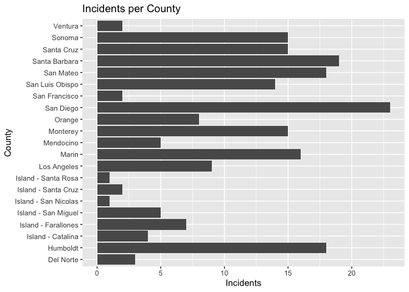
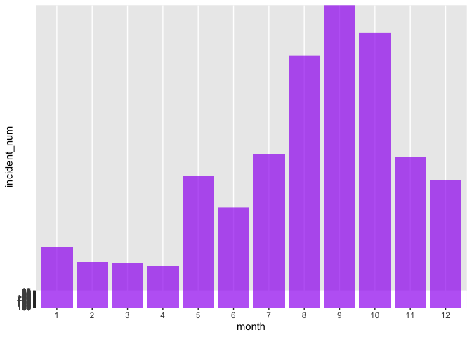
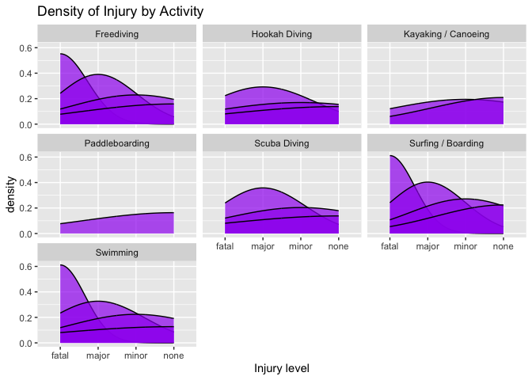
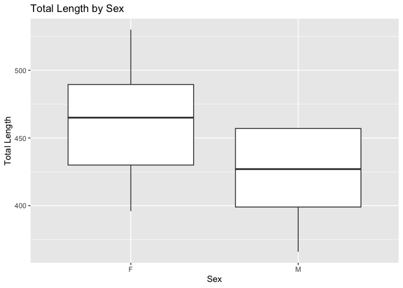

## Instructions
Answer the following questions and complete the exercises in RMarkdown. Please embed all of your code and push your final work to your repository. Your code must be organized, clean, and run free from errors. Remember, you must remove the `#` for any included code chunks to run. Be sure to add your name to the author header above. 

Your code must knit in order to be considered. If you are stuck and cannot answer a question, then comment out your code and knit the document. You may use your notes, labs, and homework to help you complete this exam. Do not use any other resources- including AI assistance.  

Don't forget to answer any questions that are asked in the prompt. Some questions will require a plot, but others do not- make sure to read each question carefully.  

For the questions that require a plot, make sure to have clearly labeled axes and a title. Keep your plots clean and professional-looking, but you are free to add color and other aesthetics.  

Be sure to follow the directions and upload your exam on Gradescope.    

## Background
In the `data` folder, you will find data about shark incidents in California between 1950-2022. The [data](https://catalog.data.gov/dataset/shark-incident-database-california-56167) are from: State of California- Shark Incident Database.   

## Load the libraries

```r
library("tidyverse")
library("janitor")
library("naniar")
```

## Load the data
Run the following code chunk to import the data.

```r
sharks <- read_csv("data/SharkIncidents_1950_2022_220302.csv") %>% clean_names()
```

## Questions
1. (1 point) Start by doing some data exploration using your preferred function(s). What is the structure of the data? Where are the missing values and how are they represented?  

```r
glimpse(sharks)
```

```
## Rows: 211
## Columns: 16
## $ incident_num     <chr> "1", "2", "3", "4", "5", "6", "7", "8", "9", "10", "1…
## $ month            <dbl> 10, 5, 12, 2, 8, 4, 10, 5, 6, 7, 10, 11, 4, 5, 5, 8, …
## $ day              <dbl> 8, 27, 7, 6, 14, 28, 12, 7, 14, 28, 4, 10, 24, 19, 21…
## $ year             <dbl> 1950, 1952, 1952, 1955, 1956, 1957, 1958, 1959, 1959,…
## $ time             <chr> "12:00", "14:00", "14:00", "12:00", "16:30", "13:30",…
## $ county           <chr> "San Diego", "San Diego", "Monterey", "Monterey", "Sa…
## $ location         <chr> "Imperial Beach", "Imperial Beach", "Lovers Point", "…
## $ mode             <chr> "Swimming", "Swimming", "Swimming", "Freediving", "Sw…
## $ injury           <chr> "major", "minor", "fatal", "minor", "major", "fatal",…
## $ depth            <chr> "surface", "surface", "surface", "surface", "surface"…
## $ species          <chr> "White", "White", "White", "White", "White", "White",…
## $ comment          <chr> "Body Surfing, bit multiple times on leg, thigh and b…
## $ longitude        <chr> "-117.1466667", "-117.2466667", "-122.05", "-122.15",…
## $ latitude         <dbl> 32.58833, 32.58833, 36.62667, 36.62667, 35.13833, 35.…
## $ confirmed_source <chr> "Miller/Collier, Coronado Paper, Oceanside Paper", "G…
## $ wfl_case_number  <chr> NA, NA, NA, NA, NA, NA, NA, NA, NA, NA, NA, NA, NA, N…
```


```r
miss_var_summary(sharks)
```

```
## # A tibble: 16 × 3
##    variable         n_miss pct_miss
##    <chr>             <int>    <dbl>
##  1 wfl_case_number     202   95.7  
##  2 time                  7    3.32 
##  3 latitude              6    2.84 
##  4 longitude             5    2.37 
##  5 confirmed_source      1    0.474
##  6 incident_num          0    0    
##  7 month                 0    0    
##  8 day                   0    0    
##  9 year                  0    0    
## 10 county                0    0    
## 11 location              0    0    
## 12 mode                  0    0    
## 13 injury                0    0    
## 14 depth                 0    0    
## 15 species               0    0    
## 16 comment               0    0
```
Many NA's in wfl_case_number, 95% wow

2. (1 point) Notice that there are some incidents identified as "NOT COUNTED". These should be removed from the data because they were either not sharks, unverified, or were provoked. It's OK to replace the `sharks` object.

```r
sharks <- sharks %>% 
  filter(incident_num!="NOT COUNTED")
```

3. (3 points) Are there any "hotspots" for shark incidents in California? Make a plot that shows the total number of incidents per county. Which county has the highest number of incidents?

```r
sharks %>% 
  group_by(county) %>% 
  summarize(incident_num=n(), .groups = 'keep') %>% 
  arrange(desc(incident_num))
```

```
## # A tibble: 21 × 2
## # Groups:   county [21]
##    county          incident_num
##    <chr>                  <int>
##  1 San Diego                 23
##  2 Santa Barbara             19
##  3 Humboldt                  18
##  4 San Mateo                 18
##  5 Marin                     16
##  6 Monterey                  15
##  7 Santa Cruz                15
##  8 Sonoma                    15
##  9 San Luis Obispo           14
## 10 Los Angeles                9
## # ℹ 11 more rows
```
San Diego


```r
sharks %>% 
  group_by(county) %>% 
  summarize(incident_num=n(), .groups = 'keep') %>%
  ggplot(aes(x=county,y=incident_num))+
  geom_col()+
  coord_flip()+
  labs(title = "Incidents per County",
       x="County",
       y="Incidents")
```

<!-- -->

4. (3 points) Are there months of the year when incidents are more likely to occur? Make a plot that shows the total number of incidents by month. Which month has the highest number of incidents?  

```r
sharks %>% 
  mutate(month=as.factor(month)) %>% 
  ggplot(aes(x=month, y=incident_num))+
  geom_col(alpha=0.7, fill="purple")
```

<!-- -->

5. (3 points) How do the number and types of injuries compare by county? Make a table (not a plot) that shows the number of injury types by county. Which county has the highest number of fatalities?  

```r
sharks %>% 
  select(county,mode,incident_num) %>%
  group_by(mode, county) %>% 
  summarize(incident_num=n(), .groups = 'keep')
```

```
## # A tibble: 64 × 3
## # Groups:   mode, county [64]
##    mode       county              incident_num
##    <chr>      <chr>                      <int>
##  1 Freediving Humboldt                       1
##  2 Freediving Island - Santa Cruz            1
##  3 Freediving Los Angeles                    2
##  4 Freediving Marin                          9
##  5 Freediving Mendocino                      5
##  6 Freediving Monterey                       4
##  7 Freediving San Diego                      6
##  8 Freediving San Mateo                      3
##  9 Freediving Santa Barbara                  1
## 10 Freediving Sonoma                         3
## # ℹ 54 more rows
```


6. (2 points) In the data, `mode` refers to a type of activity. Which activity is associated with the highest number of incidents?

```r
sharks %>% 
  group_by(mode) %>% 
  summarize(incident_num=n(), .groups = 'keep') %>% 
  arrange(desc(incident_num))
```

```
## # A tibble: 7 × 2
## # Groups:   mode [7]
##   mode                incident_num
##   <chr>                      <int>
## 1 Surfing / Boarding            80
## 2 Freediving                    35
## 3 Kayaking / Canoeing           29
## 4 Swimming                      22
## 5 Scuba Diving                  19
## 6 Hookah Diving                 10
## 7 Paddleboarding                 7
```
surfing/boarding

7. (4 points) Use faceting to make a plot that compares the number and types of injuries by activity. (hint: the x axes should be the type of injury) 

```r
sharks %>% 
  ggplot(aes(x=injury))+
  geom_density(fill="purple", alpha=0.7, color="black")+
  facet_wrap(~mode)+
  labs(title = "Density of Injury by Activity",
       x="Injury level")
```

```
## Warning: Groups with fewer than two data points have been dropped.
## Groups with fewer than two data points have been dropped.
```

```
## Warning in max(ids, na.rm = TRUE): no non-missing arguments to max; returning
## -Inf

## Warning in max(ids, na.rm = TRUE): no non-missing arguments to max; returning
## -Inf
```

<!-- -->

8. (1 point) Which shark species is involved in the highest number of incidents?  

```r
sharks %>% 
  group_by(species) %>% 
  summarize(incident_num=n(), .groups = 'keep') %>% 
  arrange(desc(incident_num))
```

```
## # A tibble: 8 × 2
## # Groups:   species [8]
##   species    incident_num
##   <chr>             <int>
## 1 White               179
## 2 Unknown              13
## 3 Hammerhead            3
## 4 Blue                  2
## 5 Leopard               2
## 6 Salmon                1
## 7 Sevengill             1
## 8 Thresher              1
```
White

9. (3 points) Are all incidents involving Great White's fatal? Make a plot that shows the number and types of injuries for Great White's only.  

```r
sharks %>% 
  select(incident_num,injury,species) %>% 
  filter(species=="White")
```

```
## # A tibble: 179 × 3
##    incident_num injury species
##    <chr>        <chr>  <chr>  
##  1 1            major  White  
##  2 2            minor  White  
##  3 3            fatal  White  
##  4 4            minor  White  
##  5 5            major  White  
##  6 6            fatal  White  
##  7 7            major  White  
##  8 8            fatal  White  
##  9 9            fatal  White  
## 10 11           none   White  
## # ℹ 169 more rows
```

## Background
Let's learn a little bit more about Great White sharks by looking at a small dataset that tracked 20 Great White's in the Fallaron Islands. The [data](https://link.springer.com/article/10.1007/s00227-007-0739-4) are from: Weng et al. (2007) Migration and habitat of white sharks (_Carcharodon carcharias_) in the eastern Pacific Ocean.

## Load the data

```r
white_sharks <- read_csv("data/White sharks tracked from Southeast Farallon Island, CA, USA, 1999 2004.csv", na = c("?", "n/a")) %>% clean_names()
```

10. (1 point) Start by doing some data exploration using your preferred function(s). What is the structure of the data? Where are the missing values and how are they represented?

```r
glimpse(white_sharks)
```

```
## Rows: 20
## Columns: 10
## $ shark           <chr> "1-M", "2-M", "3-M", "4-M", "5-F", "6-M", "7-F", "8-M"…
## $ tagging_date    <chr> "19-Oct-99", "30-Oct-99", "16-Oct-00", "5-Nov-01", "5-…
## $ total_length_cm <dbl> 402, 366, 457, 457, 488, 427, 442, 380, 450, 530, 427,…
## $ sex             <chr> "M", "M", "M", "M", "F", "M", "F", "M", "M", "F", NA, …
## $ maturity        <chr> "Mature", "Adolescent", "Mature", "Mature", "Mature", …
## $ pop_up_date     <chr> "2-Nov-99", "25-Nov-99", "16-Apr-01", "6-May-02", "19-…
## $ track_days      <dbl> 14, 26, 182, 182, 256, 275, 35, 60, 209, 91, 182, 240,…
## $ longitude       <dbl> -124.49, -125.97, -156.80, -141.47, -133.25, -138.83, …
## $ latitude        <dbl> 38.95, 38.69, 20.67, 26.39, 21.13, 26.50, 37.07, 34.93…
## $ comment         <chr> "Nearshore", "Nearshore", "To Hawaii", "To Hawaii", "O…
```

```r
miss_var_summary(white_sharks)
```

```
## # A tibble: 10 × 3
##    variable        n_miss pct_miss
##    <chr>            <int>    <dbl>
##  1 sex                  3       15
##  2 maturity             1        5
##  3 longitude            1        5
##  4 latitude             1        5
##  5 shark                0        0
##  6 tagging_date         0        0
##  7 total_length_cm      0        0
##  8 pop_up_date          0        0
##  9 track_days           0        0
## 10 comment              0        0
```

11. (3 points) How do male and female sharks compare in terms of total length? Are males or females larger on average? Do a quick search online to verify your findings. (hint: this is a table, not a plot).  


```r
white_sharks %>% 
  separate(shark, into = c("number","sex"), sep="-") %>% 
  filter(sex!="U") %>% 
  group_by(sex) %>% 
  summarise(mean_total_length=mean(total_length_cm))
```

```
## # A tibble: 2 × 2
##   sex   mean_total_length
##   <chr>             <dbl>
## 1 F                  462 
## 2 M                  425.
```
females are generally larger than males and the internet agreed

12. (3 points) Make a plot that compares the range of total length by sex.

```r
new_white <- white_sharks %>% 
  separate(shark, into = c("number","sex"), sep="-") %>% 
  filter(sex!="U")
```


```r
 new_white %>% 
  select(sex,total_length_cm) %>% 
  ggplot(aes(x=sex,y=total_length_cm))+
  geom_boxplot()+
  labs(title = "Total Length by Sex",
       x="Sex",
       y="Total Length")
```

<!-- -->

13. (2 points) Using the `sharks` or the `white_sharks` data, what is one question that you are interested in exploring? Write the question and answer it using a plot or table.  

Are females or males more mature?

```r
white_sharks %>% 
  separate(shark, into = c("number","sex"), sep="-") %>% 
  filter(sex!="U") %>% 
  group_by(maturity, sex)
```

```
## # A tibble: 17 × 10
## # Groups:   maturity, sex [4]
##    number sex   tagging_date total_length_cm maturity   pop_up_date track_days
##    <chr>  <chr> <chr>                  <dbl> <chr>      <chr>            <dbl>
##  1 1      M     19-Oct-99                402 Mature     2-Nov-99            14
##  2 2      M     30-Oct-99                366 Adolescent 25-Nov-99           26
##  3 3      M     16-Oct-00                457 Mature     16-Apr-01          182
##  4 4      M     5-Nov-01                 457 Mature     6-May-02           182
##  5 5      F     5-Nov-01                 488 Mature     19-Jul-02          256
##  6 6      M     5-Nov-01                 427 Mature     7-Aug-02           275
##  7 7      F     5-Nov-01                 442 Adolescent 10-Dec-01           35
##  8 8      M     15-Nov-01                380 Mature     14-Jan-02           60
##  9 9      M     15-Nov-01                450 Mature     12-Jun-02          209
## 10 10     F     15-Nov-02                530 Mature     14-Feb-03           91
## 11 12     M     27-Oct-03                396 Mature     23-Jun-04          240
## 12 14     M     5-Nov-04                 457 Mature     9-Apr-05           155
## 13 15     M     5-Nov-04                 457 Mature     10-Apr-05          156
## 14 16     M     5-Nov-04                 427 Mature     10-May-05          186
## 15 18     F     30-Nov-04                396 Adolescent 12-Jun-05          194
## 16 19     F     30-Nov-04                490 Mature     3-May-05           154
## 17 20     F     3-Dec-04                 426 Adolescent 8-Feb-05            67
## # ℹ 3 more variables: longitude <dbl>, latitude <dbl>, comment <chr>
```

